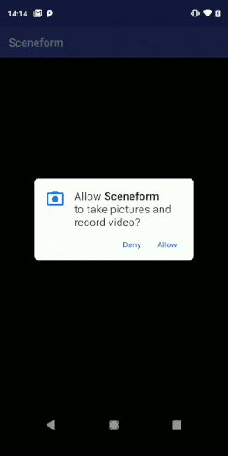

# SceneForm Video Demo

This project uses [Augmented Images](https://developers.google.com/ar/develop/c/augmented-images/) from ARCore to track and physically locate predetermined images/shapes in an AR session, then uses this to play a video over top of it.

## Architecture  
The code created for this project uses the MVP design architecture and a module approach 
### Modules
This project is made of 2 modules **sceneform > app**
- **sceneform** 			(SceneForm library, 3d objects and image rec DB)
- **app** 					(base MVP and app arch, Activity, layout etc)

### Libraries  
- Kotlin 1.2.71
- SceneForm 1.5
- Timber